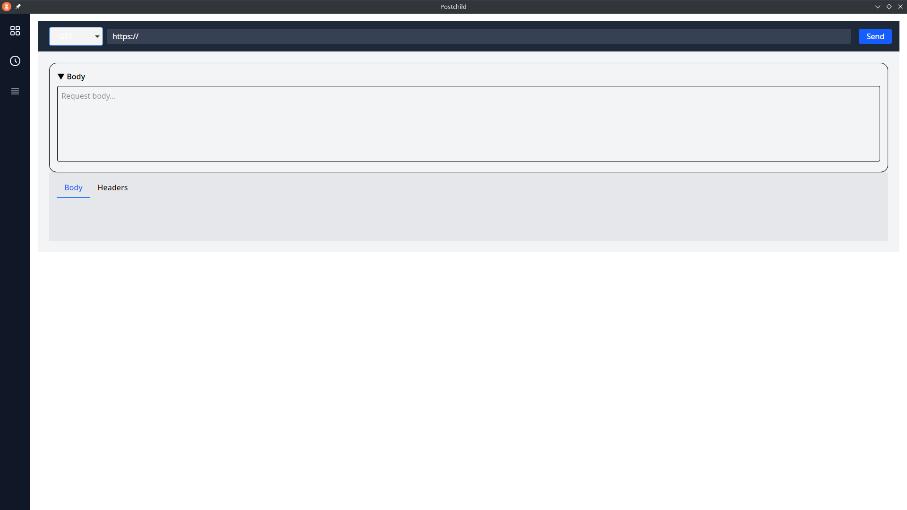
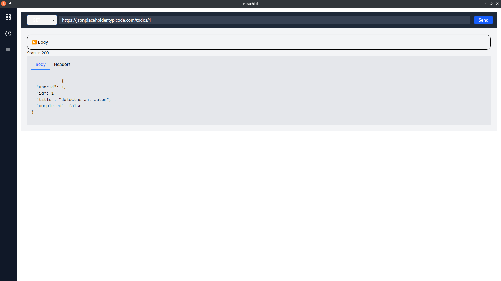
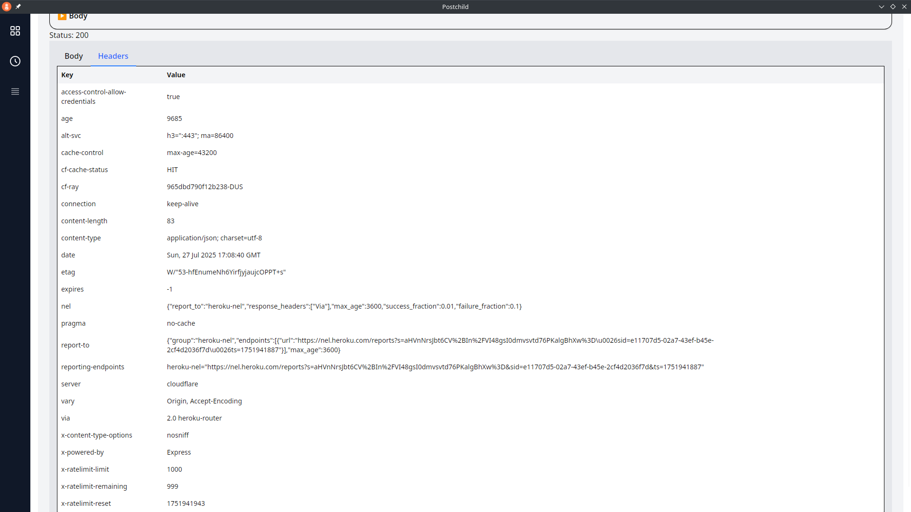
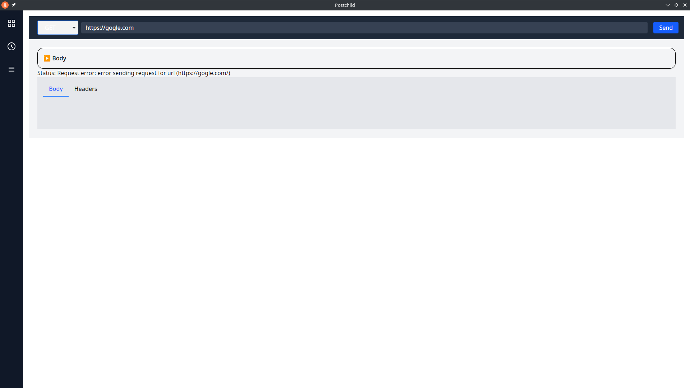
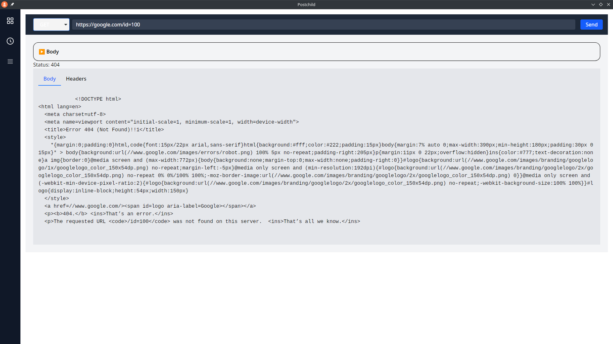

# Postchild

This is the repository for the Hackathon participation on the [boot.dev](https://www.boot.dev) platform. The idea is to write a smaller version of Postman application.
For those not familiar with Postman, to simplify it, it's an application for testing API Endpoints with POST and GET requests and add visualisation to it, store the requests and responses in files and more. Postchild will try to replicate some of the most used features.

It is a Svelte + TypeScript desktop application built with Tauri 2 and Rust in its backend. It is deployed and confirmed to run on Ubuntu 24.04. A built artifact *.deb can be downloaded and installed on said distribution.

## 🚀 Download & Run

1. Visit the [Releases](https://github.com/AShkolnik/Postchild/releases/tag/hackathon) page.
2. Download the `Postchild-deb.zip` for Ubuntu 24.04.
3. Unzip it
4. Install it:
   ```bash
   dpkg -i PostchildApp_0.1.0_amd64.deb
   ```

## User Interface Presentation

### Main Application Interface

It provides a way to pass down a specific HTTP Method (GET, PUT, POST, DELETE are supported).



You get the HTTP-Response as plain text for now in the body tab with its HTTP-Headers in its own headers tab.





The other HTTP-Methods are also working fine, with the addition of some Error Messages being displayed as well.






## 🧰 Setup and Development

### Installing Dependencies

```bash
sudo apt update
sudo apt install libwebkit2gtk-4.1-dev build-essential curl wget file libayatana-appindicator3-dev librsvg2-dev
```

### Building Frontend & Backend

```bash
npm install
npm run tauri dev
```

1. Installs TypeScript, Svelte, front-end dependencies. 
2. Compiles Rust backend and launches the app

## 🔧 Troubleshooting Notes

- glibc compatibility: You must build on Ubuntu 24.04 if that's the target runtime environment. Building on newer systems may break on older ones due to mismatched glibc versions 
- WebKit/WebView: Make sure libwebkit2gtk‑4.1 is installed on both build and target machines.
